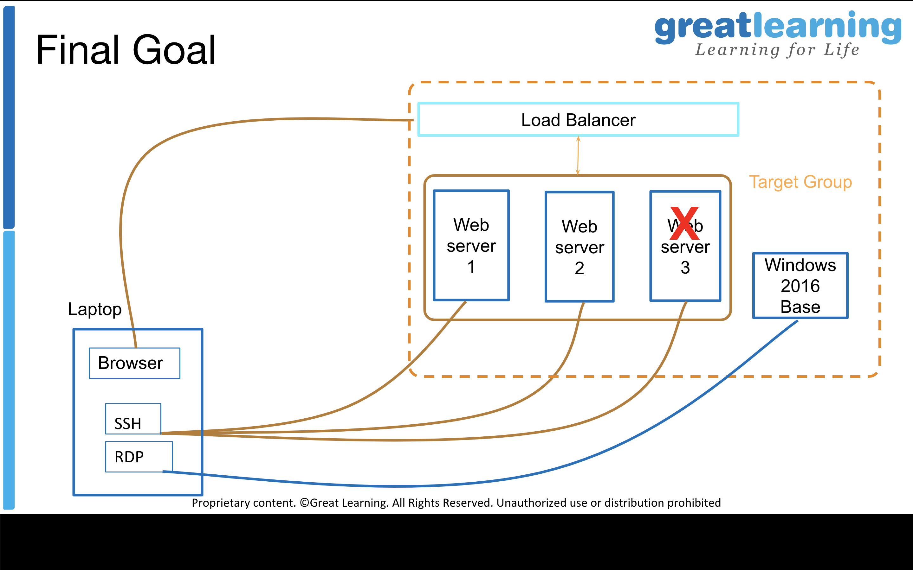

# EC2 | Multi AZ Deployment | Load Balancing
(Deploy multiple EC2 instances in different AZs and experiment with load balancing, target groups and understand the impact of instance failure)

## Learning Outcomes
1.Be able to create multiple EC2 instances (VMs) on AWS public cloud
2.Learn how to create key pairs and SSH into VMs
3.Understand and leverage concepts of VPC, Subnets (Availability Zone) and Securitygroups.
4.Understand and implement load balancer, target groups and simulate instance failure
5.Understand session affinity and stickiness
6.Understand instance health checks and load balancing algorithms
7.Create and access Windows VM on AWS cloud

## Final Goal

 


## What is needed?
1. AWS Account Credentials
2. EC2 Instances (Linux and Windows)
3. Load Balancer
4. Target Group
5. Linux Terminal for ssh access from your laptop
6. Remote Desktop application (specific to your laptop's OS)
7. Lab Access 


## Steps - Command reference

### Login to ec2
To ssh use the following command:
1. chmod 400 [PEM file name]
2. ssh -i [PEM file name] ec2-user@[PUBLIC IP]


### configure the http server use the following:
```
sudo yum update
sudo yum install httpd
sudo service httpd start
curl localhost
sudo su
echo "Web server 1" > /var/www/html/index.html 
```

How to do it?Use t2.micro / t2.small instances only for this lab.
1.  Create an Amazon AMI EC2 instance using the 7 step workflow
   
a)SSH to the instance 
b)Install a simple http server
c)configure a new security group for http
d)Test the web server from a browser tab

2.  Create 2 more EC2 instances
e)in different AZ
f)using "Launch more like this" instance
g)configure each of them a bit differently (web server 1,2,3)
h)setup the health check /health.html on each server
i)tag each instance appropriately
j)Reuse the SG, PEM 


How to do it?
3. Grab a Load Balancer, create a Target Group and assign all these EC2 instances tothe Target Group 
   Hit the LB multiple times and observe the RR in action
4. Simulate failure by stopping the EC2 instance
   a)See the effect on the LB
   b)Hit the LB again after the failure
5. Treasure hunt & cleanup: Find out where we can specify the session affinity setting

!Lab Challenge: Launch a windows instance using the 7 step flow and login to it. 
