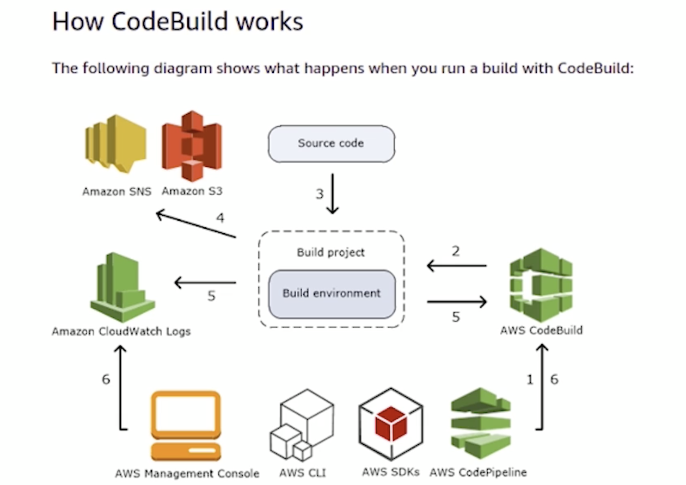
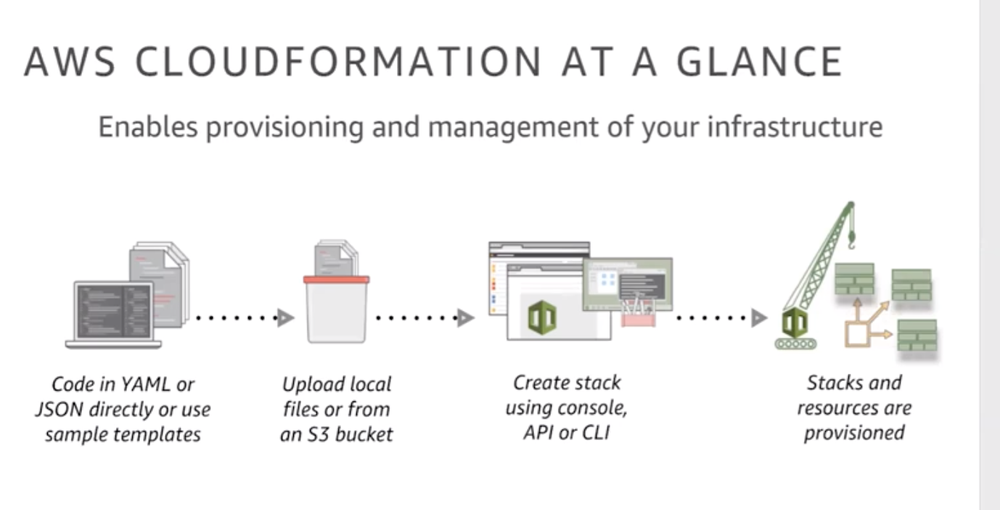

# Cloud Native DevOps

## DevOps on AWS (~4Hr 30mins)

### AWS Cloud Trail

### AWS Storage Gateway
    1. Enabling cloud workloads   
    2. Backup and archive to Aws   
    3. Tiered Storage in AWS   
* File Gateway
* Volume Gateway

* Mobile archive services provided by AWS 
  * Snowball - terrabyte Scale
  * Snowmobile - petabyte Scale

### Module 3 - Operations Workflow overview (~6mins)-3   
```
Code -> Code Commit ( AWS Managed Git Code Connect ) -> Code Build -> Code Deploy
A code pipeline automates the complete process
```

### Module 4 - Operations Workflow details (~15mins)-3   

Create an automated pipeline to deploy code once commit is done.


### Module 5 - Setup EC2(Dev), IAM (~10mins)-3   
* Create Ec2 
  * Open Port 8080 for Tomcat 
* Create IAM Role and attach below policies
  * Assign policy 
    * <mark>AWSCodeCommitFullAccess</mark>
    * <mark>AWSCodeDeployFullAccess</mark>
    * <mark>AWSCodePipelineFullAccess</mark>
    * <mark>AWSCloudWatchFullAccess</mark>
    * <mark>s3FullAccess</mark>
* Attach the Role created above to EC2 instance created above
* ssh to EC2 server
* sudo apt update
* * sudo apt install aws cli
* aws configure 
* cd /opt
* sudo chown ubuntu ubuntu -R /opt/


### Module 6 - CodeCommit Repo, Opsroot User (~10mins)-3   
* Open Code Commit Service 
* Create Repository
* 

### Module 7 - Setup SSH, GitClone (~15mins)-3   
### Module 8 - Code Setup, GitPush (~10mins)-3   

CodeCommit commands-3
```
Codebase synch commands

mkdir /opt/temp
cd /opt/temp
To be executed on your local laptop
scp -i your.pem HelloWorld-CodeBase.tar.gz ubuntu@PUBLIC-IP:/opt/temp
tar -zxf HelloWorld-CodeBase.tar.gz
cd HelloWorld
rm -rf .git
rsync -r /opt/temp/HelloWorld/ /opt/helloworld
cd /opt/helloworld
rm -rf /opt/temp
Git commands

cd /opt/helloworld
git add .
git status
git commit -a -m “First commit”
git push origin master
```

### Module 9 - CodeBuild Principles (~15mins)-2   
### Module 10 - CodeBuild Project Setup (~20mins)-2   
### Module 11 - Run Build Manually (~5mins)-2   
### Module 12 - CodeDeploy Principles (~5mins)-2   
### Module 13 - EC2(prod), CodeDeploy Service Role (~10mins)-2   
### Module 14 - CodeDeploy Agent Installation (~10mins)-2   
### Module 15 - CodeDeploy Service Setup (~15mins)-2   
CodeDeploy commands-2

### Module 16 - CodePipeline Setup (~15mins)-2   



### Module 17 - Pipeline execution, Human approval (~15mins)-2   
### Module 18 - Build env, Error simulation with pipeline (~10mins)-2   

[DIY - Creating CodePipeline](Creating_CodePipeline.pdf)   
### Module 19 - Elastic Beanstalk (~1Hr)-2   

## Cloud Formation and Terraform (~4 Hrs)
### Module 20 - AWS Cloud Formation Overview (~ 20 mins)-3   

### Module 21 - AWS Cloud Formation Template and Demo (~1 hour)-3   

* [DIY - Cloud Formation](./files/DevOps_CloudFormation_ALB_EC2-1.pdf)   
* [CF1.json](./files/CF1.json)   
* [CF1.json](./files/CF1.json)   


### Module 22 - Terraform Essentials (1Hr 15Mins)-3   
### Module 23 - Terraform templating and trouble shooting (~1hr 30mins)-3   

* [IaC using AWS Lambda](./files/IaC_using_AWS_Lambda.pdf)
* [myIaaC.py](./files/myIaaC.py)
* [specifications.json](./files/specifications.json)
* [test.json](./files/test.json)


Practice Lab - CI_CD_CodePipeline

* DevOps_CloudFormation_ALB_EC2.pdf
* Lab Solution-Cloud Formation-2
* DevOps_Terraform_ALB_EC2.pdf
* Lab Solution - Terraform-2
    test.json
