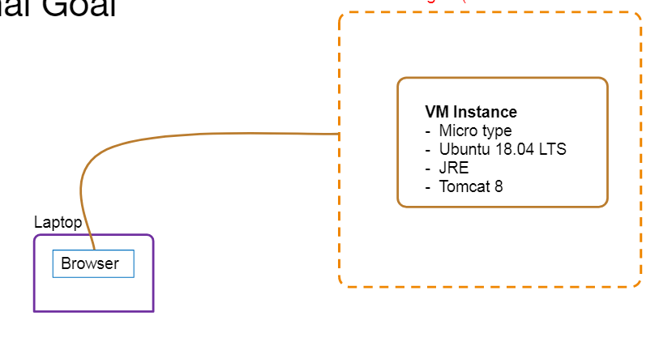

# google Compute engine 
## Java Web App(Create VM Instance, SSH, Install JRE, Install Tomcat, Run Sample Java Web application.)

## Learning Outcomes

1.  Be able to create Compute Engine VM Instance
2.  Connect to instance using SSH via web browser
3.  Setup Apache Tomcat-8 and Its dependencies
4.  Deploy the Java Web Application on your instance 

## Final Goal
BrowserGCP Region (us-central1)LaptopVM Instance-  Micro type- Ubuntu 18.04 LTS- JRE- Tomcat 8 

## What is needed?
1. GCP account credentials
2. Laptop/Desktop with Web Browser 

## How to do it? - Part 1

1. Ensure your GCP region is set to "us-central-1"
2. Create VM Instance (use micro (1 shared vCPU) instance type only)
    a) Select your preferred Zone
    b) Use  Ubuntu 18.04 LTS Boot diskc)10 GB standard persistent disk
    d) Identity and API access  - Leave default options
    e) Under networking provide Network tags name required to apply firewall rule
3. Create Firewall rule - Open Tomcat Server Port 8080
    a) Once instance is created, click on instance name, under Network Interfaces section, Click on ViewDetails.
    b) Existing Networking details will be displayed
    c) In the left navigation options, choose Firewall Rules->Create Firewall Rule
    d)Provide name, Under Targets choose Specified Target Tags, Provide name provided in step 2.e
    e) Under source filters, choose IP ranges, provide 0.0.0.0/0 as source IP ranges
    f) Under Protocols and ports, choose specified protocols and port, select tcp and enter port 8080 

## SSH and Setup packages using GCP Web Console
* Goto VM instance listing page. For the created VM instance, under connect options, click onarrow next to SSH and choose Open in browser window option
* New pop-up window will open shell window
* Run following commands
    sudo apt-get update
    sudo apt-get -y install default-jdk
    java -version
    sudo apt-get -y install tomcat8
    curl localhost:8080
    wgethttps://storage.googleapis.com/skl-training/aws-codelabs/aws-intro/HelloWorld.war
    sudo cp HelloWorld.war /var/lib/tomcat8/webapps/
* Check default tomcat page by entering instance external ip and port - http://<ip>:8080 inbrowser
* Access Deployed application using application context http://<ip>:8080/HelloWorld in browserHow to do it? - Part 2 

 ## Resource Clean-Up
 1. Cloud is always pay per use model and all resources/services that we consume arechargeable. Cleaning up when you’ve completed your lab or project is always necessary.This is true whether you’re doing a lab or implementing a project at your workplace.
 2. After completing with the lab, make sure to delete each resource created in the reversechronological order.
 3. Check resources in each cloud region that you have worked on before logging off.
 4. Since the dashboard doesn’t show cross-region resources, it is up to you to find and delete them
