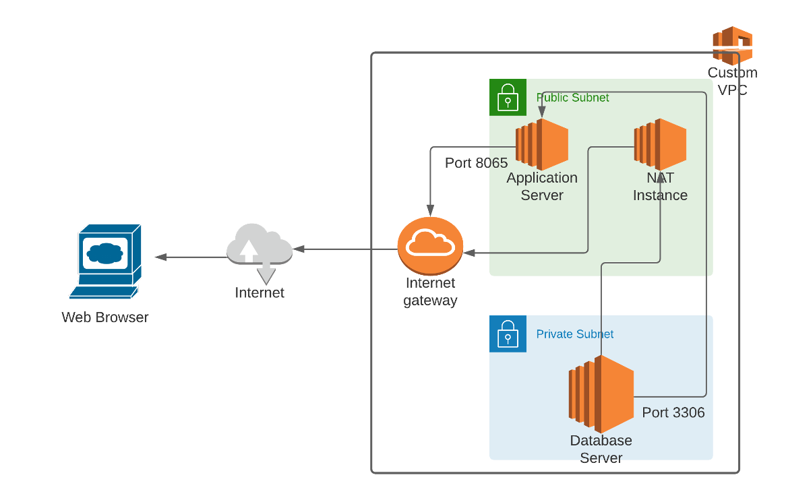

# Project Details 

## Architecture diagram

## Architecture Implementation	
1. Implement 2 different subnets (one public and the other private) in a custom VPC   
2. Install and configure MySQL on an Ubuntu 18.04 instance on the private subnet using the instructions provided. (Hint: Use a bastion host and a NAT instance)   
3. Install and configure Mattermost on an Ubuntu 18.04 instance on the public subnet using the provided instructions.   
4. Configure the security groups to allow the ports as shown in the architecture.   
5. Test the installation by accessing the IP of the public instance in a browser via the port 8065.   
