## Step 1 VPC and Subnet Creation	

### Step number	a - Creation of VPC
#### Instructions	
1) Navigate to VPC using the Services button at the top of the screen
2) Select "Your VPCs" on the left side of the screen
3) Click  on "Create VPC"
4) Enter the following fields :
     Name : Project 1 VPC
     IPv4 CIDR Block : 10.0.0.0/16
     The rest of the options can be ignored
5) Select "Create VPC"
6) Select the VPC and click on Actions->Edit DNS hostnames
7) Enable DNS hostnames and click on Save 
	Expected screenshots	1) Created VPC with properties visible
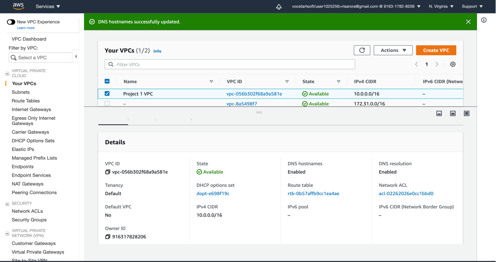

### Step number	b - Creation of public subnet
#### Instructions	
1) Navigate to VPC->Subnets
2) Click on "Create Subnet"
3) Enter the following fields
    Name tag : Public Subnet
    VPC : Select the Project 1 VPC
    IPv4 CIDR block : 10.0.1.0/24
    The other options can be ignored
4)  Click on Create
5)  Once the subnet has been created, select the subnet and click on Actions->Modify Auto-assign IP settings
6)  Enable the option "Auto assign IPv4" and select Save

#### Expected screenshots	
1) Subnet Creation screen
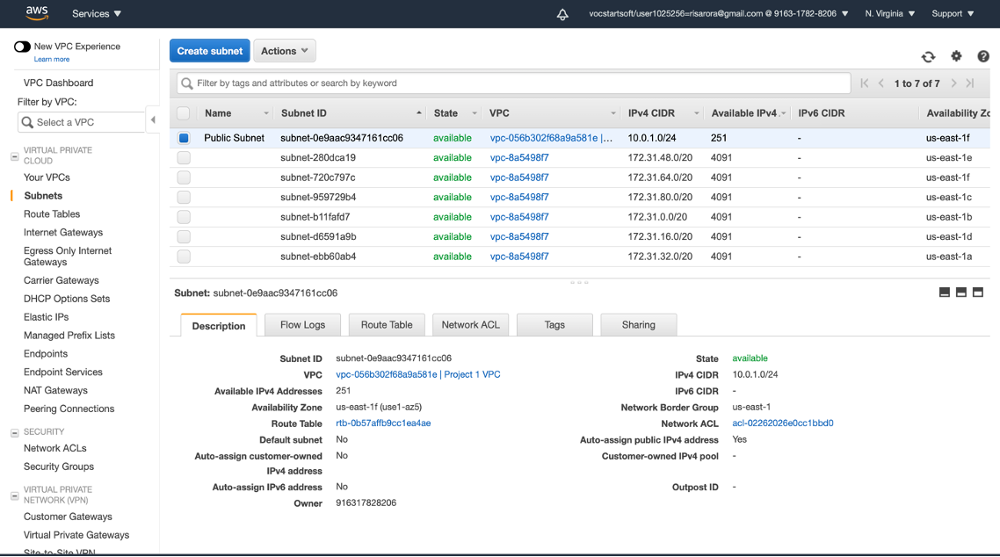

### Step number	c - Creation of private subnet
#### Instructions	
1) Navigate to VPC->Subnets
2) Click on "Create Subnet"
3) Enter the following fields
    Name tag : Private Subnet
    VPC : Select the Project 1 VPC
    IPv4 CIDR block : 10.0.2.0/24
    The other options can be ignored
4) Click on Create
#### Expected screenshots	
1) Subnet Creation screen
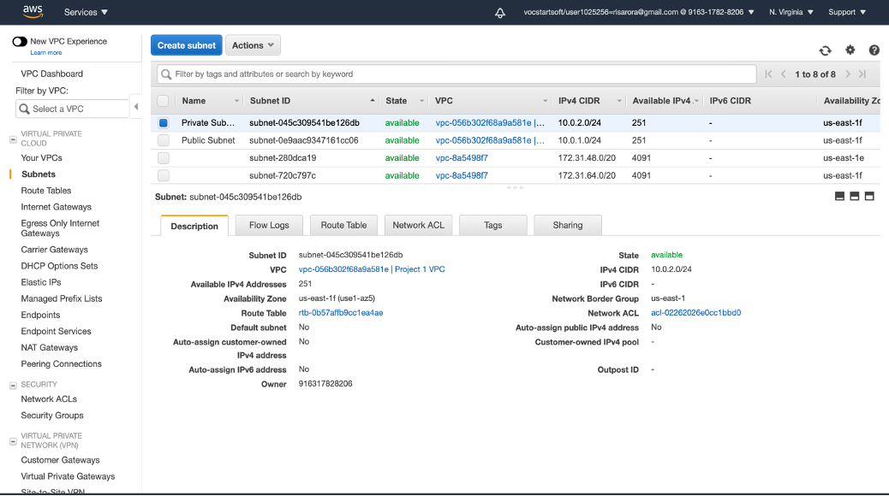

## Internet Gateway and VPC	

### Step number	a - Creation and Configuration of Internet Gateway

### Instructions	
1) Navigate to VPCs->Internet Gateway
2) Click on "Create Internet Gateway"
3) Enter the name tag "Project 1 Internet Gateway" and click on "Create Internet Gateway"
4) After the gateway is created, select it and click on Actions->Attach to VPC
5) Select the Project 1 VPC and click on "Attach Internet Gateway" 

#### Expected screenshots	
1) Creation of Internet Gateway
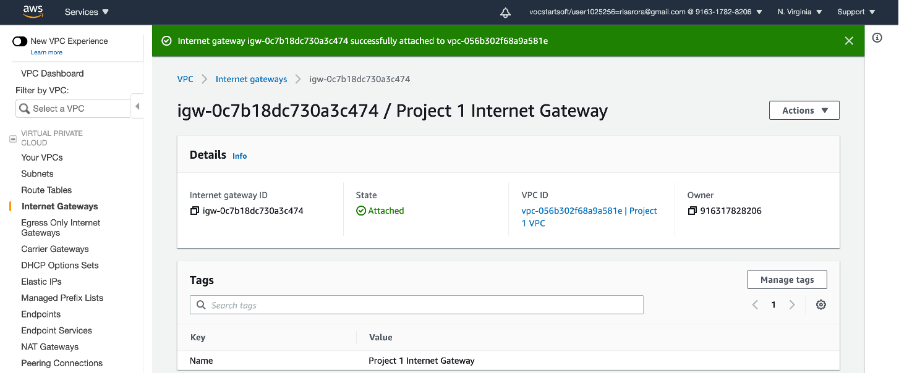

### Step number	b - Creation of public route table

### Instructions	
1) Navigate to VPC -> Route Tables and click on Create Route table
2) Enter the name tag "Public Route Table", select the Project 1 VPC from the dropdown and click on Create
3) Once the route table is created, select it and select the Routes tab below the list of route tables
4) Click in Edit Routes and add the following route (Don't edit the existing one) 
    - Destination : 0.0.0.0/0
    - Target : Select Internet Gateway and the select the Project 1 Internet Gateway
    Click on Save Routes
5) Select the Subnet Associations tab and click on Edit Subnet Associations
6) Select the Public Subnet from the list and click on Save
#### Expected screenshots	
1)  Route list of the route table	
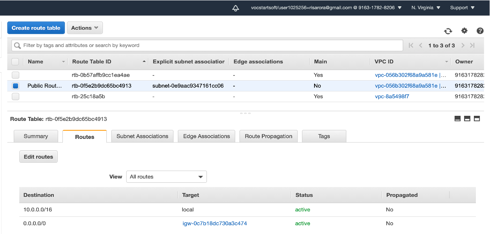
2)  Subnet Associations of the route table
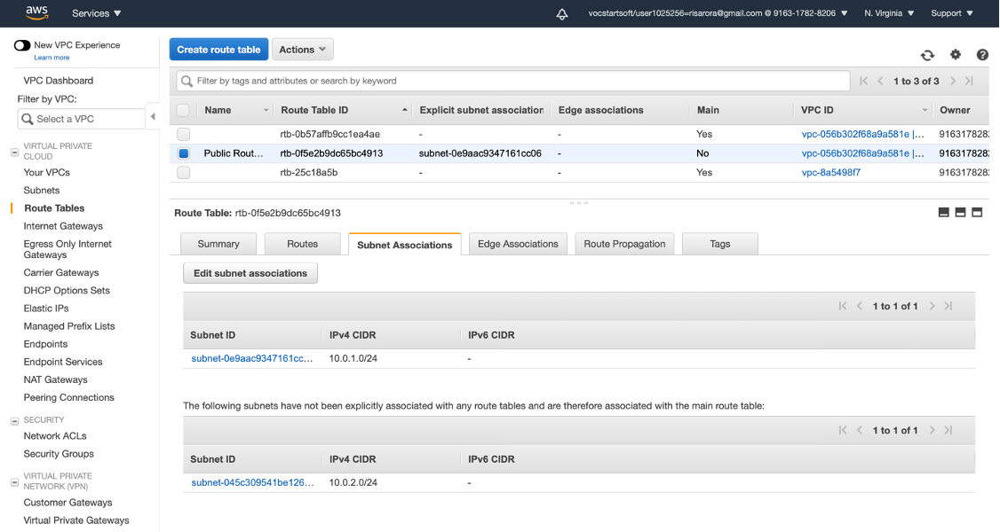

### Step number	c - Creation of NAT instance

#### Instructions	
1) Navigate to EC2 using the Services button at the top of the screen
2) Select Instances at the left side of the screen
3) Click on Launch Instance
    - Select the AMI for NAT instances under Community AMIs
    - Select the instance type t2.micro
    -  Select Network as "Project 1 VPC" and subnet as "Public Subnet" 
    - For the security group, open the ports 22,80 and 443 for source set to "Anywhere"
4) Launch the instanch
5) Once the instance is launched, select the instance and click on Actions->Networking -> Change Source/Dest. Check and disable Source/Destination Check
#### Expected screenshots	
1) Configure Instance Details	
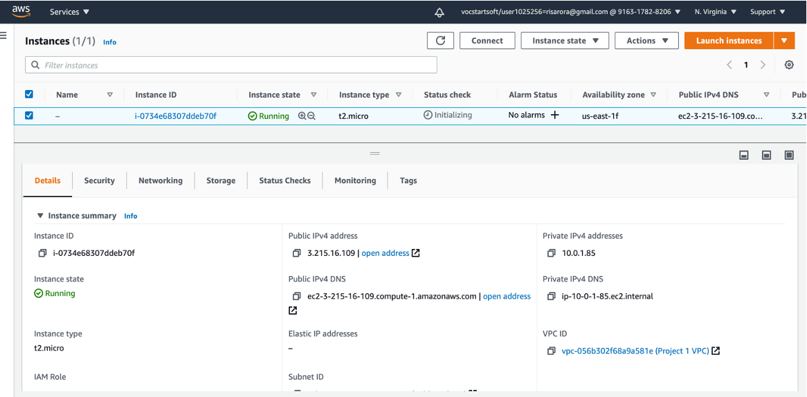
2) Security Group rules
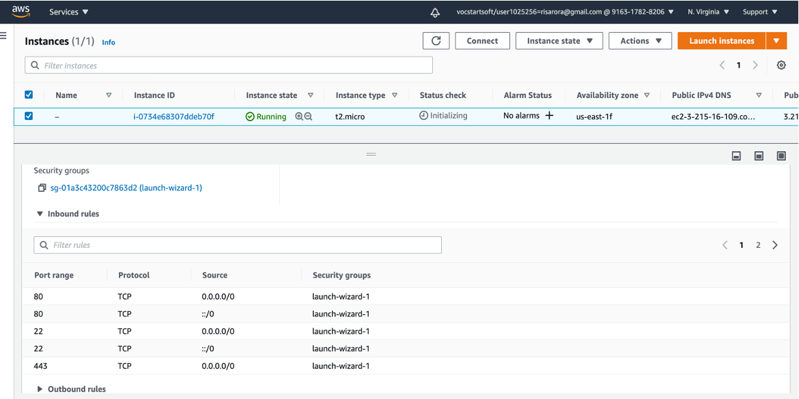
3) Instance after creation																						
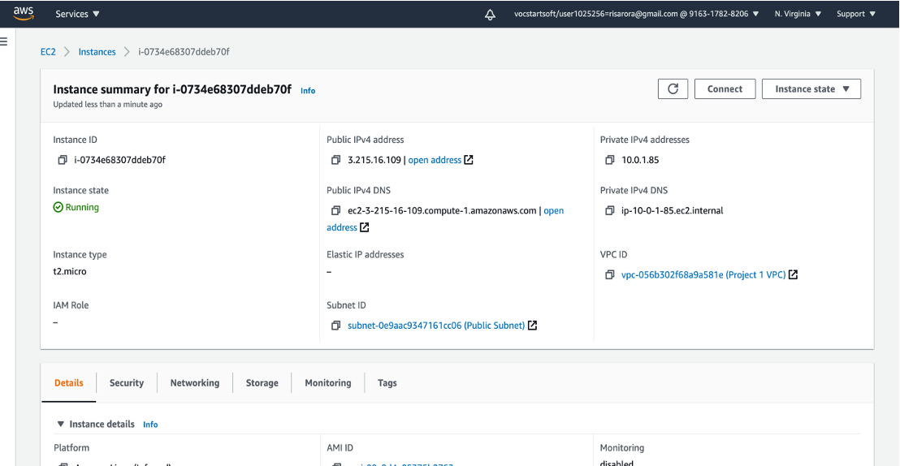

### Step number	d - Creation of private route tables

#### Instructions	
1) Navigate to VPC -> Route Tables and click on Create Route table
2) Enter the name tag "Private Route Table", select the Project 1 VPC from the dropdown and click on Create
3) Once the route table is created, select it and select the Routes tab below the list of route tables
4) Click in Edit Routes and add the following route (Don't edit the existing one) 
    - Destination : 0.0.0.0/0
    - Target : Select Instances and the select the NAT instance created in the previous step
    Click on Save Routes
5) Select the Subnet Associations tab and click on Edit Subnet Associations
6) Select the Public Subnet from the list and click on Save
#### Expected screenshots	
1) Route list of the route table
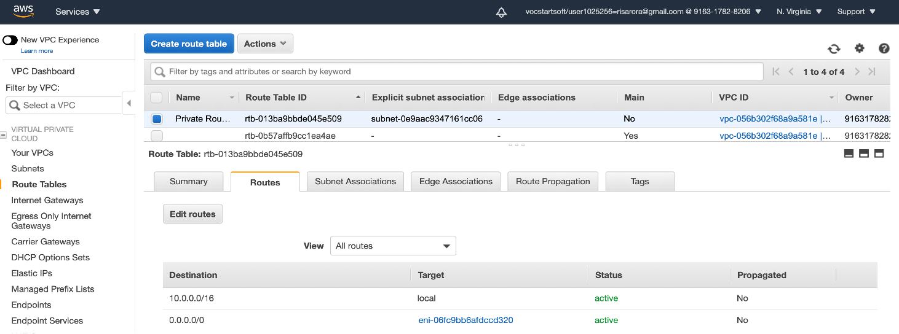
2) Subnet Association of the route table
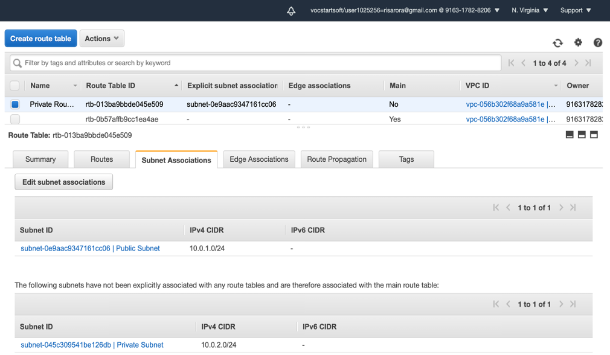

## Creation of Application and Database Servers	

### Step number	a - Creation of application server

#### Instructions	
1) Navigate to EC2 using the Services button at the top of the screen
2) Select Instances at the left side of the screen
3) Click on Launch Instance
    - Select the AMI Ubuntu 18.04 LTS
    - Select the instance type t2.micro
    -  Select Network as "Project 1 VPC" and subnet as "Public Subnet" 
    - For the security group, open the ports 22 and 8065 for source set to "Anywhere" 
4) Launch the instanch after creating a new pem file and downloading it

#### Expected screenshots	
1) Instance Configuration screen
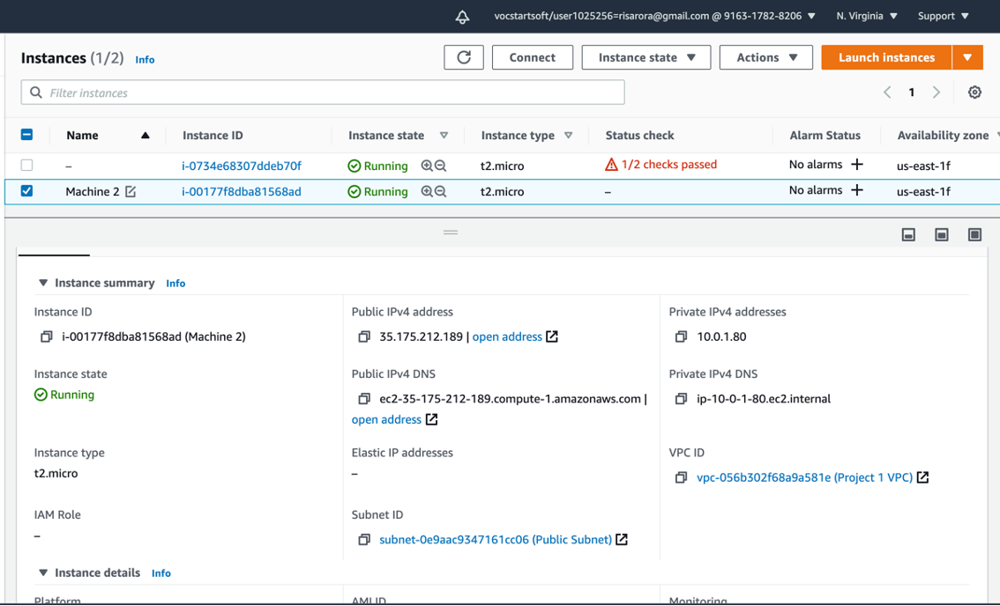
2) Security Group rules
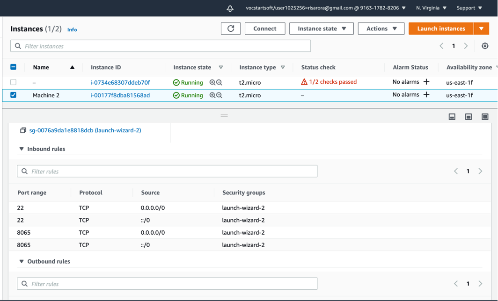
### Step number	b - Creation of database server

#### Instructions	
1) Navigate to EC2 using the Services button at the top of the screen
2) Select Instances at the left side of the screen
3) Click on Launch Instance
    - Select the AMI Ubuntu 18.04 LTS
    - Select the instance type t2.micro
    -  Select Network as "Project 1 VPC" and subnet as "Private Subnet" 
    - For the security group, open the ports 22 and 3306 for source set to "Anywhere" 
4) Launch the instanch by selecting the same pem file created in the previous step"
#### Expected screenshots	
1) Instance Configuration screen	
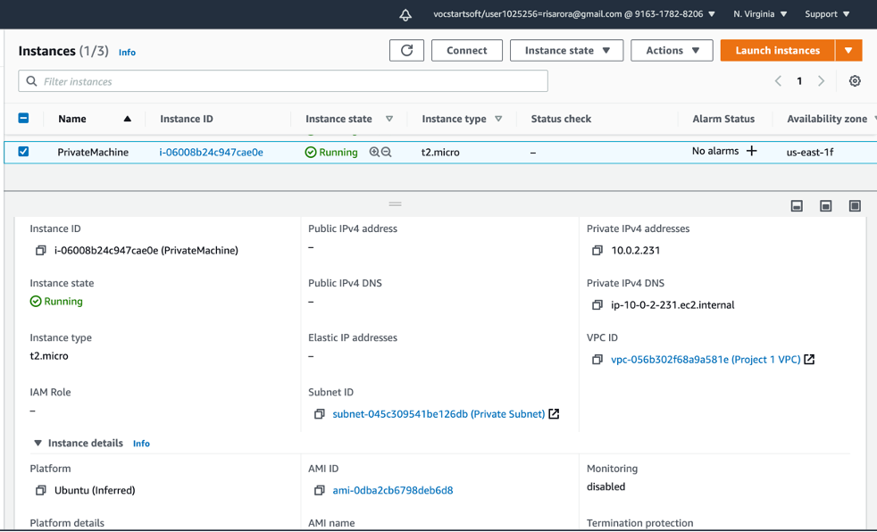
2) Security Group rules
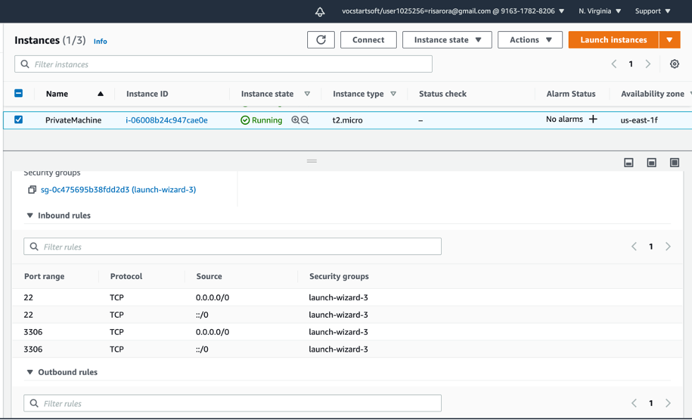

## Application and Database Installation and Testing	

### Step number	a - Installation and configuration of MySQL

#### Instructions	
1) Copy the database pem file into the application server using the below command 
     scp -i <application server pem file> <database server pem file > ubuntu@<application server public IP>:/home/ubuntu
2) Log into the application server using SSH/Putty
3) From the application server, log into the database server using the pem file copied in step 1and the private IP address of the database server with the following command
    ssh -i <database server pem file> ubuntu@<private IP of database server>
4) Enter the following commands to install and configure MySQL on the database server
    wget https://storage.googleapis.com/skl-training/aws-codelabs/mattermost/install_mysql.sh
    chmod 700 install_mysql.sh
    sudo ./install_mysql.sh
5) Type exit to exit the database server and  go back to the application server"
#### Expected screenshots	
1) Downloading of the provided script	
2) Executing the given script

### Step number	b - Installation and configuration of Mattermost

#### Instructions	
1) Enter the following commands after logging into the application server via SSH to install and configure Mattermost
```
    wget https://storage.googleapis.com/skl-training/aws-codelabs/mattermost/mattermost_install.sh                                                        
    chmod 700 mattermost_install.sh                                                        
    sudo ./mattermost_install.sh  <private IP of MySQL server>                                                        
    Example : sudo ./mattermost_install.sh 173.65.34.7                                                        
    sudo chown -R mattermost:mattermost /opt/mattermost                                                        
    sudo chmod -R g+w /opt/mattermost                                                        
    cd /opt/mattermost                                                        
    sudo -u mattermost ./bin/mattermost                    
```
2) Check whether the server has been successfully deployed by navigating to the following URL in your web browser
     <public IP of the application server>:8065
#### Expected screenshots	
    1) Executing the script	
    2) Starting the Mattermost server
    3) Accessing the appication via web browser																					