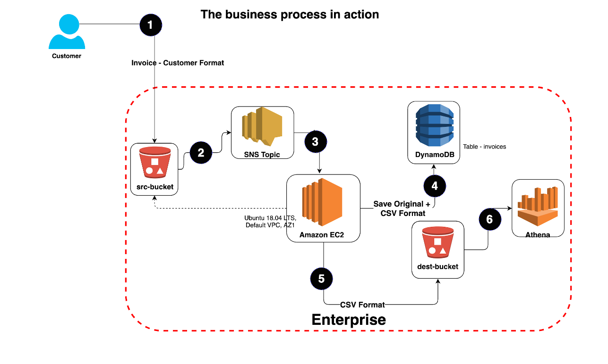

# Project Details 

* The customer uploads the invoice data to S3 bucket in a text format as per their guidelines and policies. This bucket will have a policy to auto delete any content that is more than 1 day old (24 hours).
* An event will trigger in the bucket that will place a message in SNS topic								
* A custom program running in EC2 will subscribe to the SNS topic and get the message placed by S3 event
* The program will use S3 API to read from the bucket, parse the content of the file and create a CSV record along with saving the original record in DynamoDB									
* The program will use S3 API to write CSV record to destination S3 bucket as new S3 object.
* Athena is used to query the CSV file (query to show aggregated expenses grouped by date).									


# Step 2 - S3 and SNS topic creation

### Step number	a

#### Step name	Creation of Source  and target buckets

**Instructions**	
1) Navigate to S3 using the Services button at the top of the screenSelect 'Create Bucket' 
2) Enter a source bucket name and use the default options for the rest of the fields
3) Click on 'Create Bucket'
4) Repeat the above steps to create a target bucket

Expected screenshots	1) Screen showing created S3 source and target buckets


	Place Screenshot for Step 2(a)


	
### Step number	b

#### Step name	Creation of SNS subscription

**Instructions**	
1) Navigate to SNS -> TopicsClick on 'Create Topic'
3) Enter the following fields
    Name : S3toEC2Topic
    The other options can b ignored for now
4) Click on Create Topic

Expected screenshots	1) Creation of SNS topic


	Place Screenshot for Step 2(b)
	

### Step number	c

#### Step name	Modification of SNS Access Policy 

**Instructions**	
1) Navigate to SNS -> Topics and select the topic created in the previous stepNote down the ARN shown in the topic details
2) Click on Edit and select 'Access Policy'.
3) Replace the text in the JSON editor with the followin
```
{
 "Version": "2012-10-17",
 "Id": "example-ID",
 "Statement": [
  {
   "Sid": "example-statement-ID",
   "Effect": "Allow",
   "Principal": {
    "AWS":"*"  
   },
   "Action": [
    "SNS:Publish"
   ],
   "Resource": "arn:aws:sns:us-east-1:916317828206:S3toEC2Topic",
   "Condition": {
      "ArnLike": { "aws:SourceArn": "
      
      arn:aws:s3:::glsource
      arn:aws:s3:*:*:glsource" },
      "StringEquals": { "aws:SourceAccount": "916317828206" }
   }
  }
 ]
}
```

// arn:aws:sts::916317828206:assumed-role/vocstartsoft/user1025256=risarora@gmail.com

1) Replace the bold text with the SNS topic ARN, source bucket name and your AWS account ID respectively.      
2) Click on Save Changes

Expected screenshots	1) JSON Editor screen


	Place Screenshot for Step 2(c)

# Step 3 - Run the custom program on the EC2 instance
	
### Step number	a

#### Step name	Creation of the EC2 instance

**Instructions**	
1) Navigate to EC2 -> InstancesCreate an EC2 instance with the following parameters
     AMI : Ubuntu 18.04 LTS
     VPC : Default
     Security group : Ports 22and 8080 should be opened

Expected screenshots	1) List of instances after creation of EC2 instance


	Place Screenshot for Step 3(a)


### Step number	b

#### Step name	Creation of IAM role for EC2 instance

**Instructions**	
1) Navigate to IAM- > RolesSelect Create Role
3) Use the following parameters to create the role
     Trusted Entity  - AWS Service
     Use Case - EC
     Policies to attach - Amazon S3 Full Access and AmazonDynamoDBFullAccess
     Role Name : ec2-s3-access
4) Click on Create Role
5) Navigate back to EC2- > Instances
6) Select the EC2 instance created in the previous step and select Actions-> Security -> Modify IAM role
7) Select the role ec2-s3-access from the dropdown and click on Save

Expected screenshots	1) Modify IAM role screen


	Place Screenshot for Step 3(b)
	
### Step number	c

#### Step name	Configuration and Uploading of custom program
**Instructions**	
1) Open the drive link given under Architecture implementation in Step 1 and download the file docproc-new.zip on your machine
1) Unzip the downloaded file
2) Enter the unzipped folder and open the file views.py in the API folder using a text editor
3) In line number 19, modify the target bucket name to the one created in Step 2 (a) and save the file
4) Copy the folder docproc-new to the home folder of the EC2 instance created in Step 3(a) using scp. Use the command given below
```
chmod 400 glccp.pem
scp -i glccp.pem -r ./docproc-new ubuntu@54.146.93.185:/home/ubuntu
```

Expected screenshots	
1) Modifying of the views.py file to point to the target bucket

2) Copying the folder to the EC2 instance															
								

# Step 4 - Creation and Verification of SNS subscription and Generation of CSV file
	
### Step number	a

#### Step name	Starting the EC2 custom program

**Instructions**	
1) Log into the EC2 instance using SSH
```
bash-3.2$ ssh -i "glccp.pem" ubuntu@ec2-54-146-93-185.compute-1.amazonaws.com
```
2) Run the followng commands after successful SSH to start the server

```
    sudo cp -r docproc-new /opt
    sudo chown ubuntu:ubuntu -R /opt 
    cd /opt/docproc-new
    sudo apt update
    sudo apt install python-pip -y
    python -m pip install --upgrade pip setuptools
    sudo apt install virtualenv -y
    virtualenv ~/.virtualenvs/djangodev
    source ~/.virtualenvs/djangodev/bin/activate
    pip install django
    pip install boto3
    python manage.py runserver 0:8080
```
Keep this terminal window open throughout the rest of the exercise

Expected screenshots	
1) Server in waiting state
Place Screenshot for Step 4(a)


### Step number	b

#### Step name	Creation of SNS subscription
**Instructions**	
1) Navigate to SNS in the AWS Console and select the topic S3ToEC2Topic
2) Click on Create Subscription
3) Enter the following details
     Protocol : HTTP
     Endpoint : http://54.146.93.185:8080/sns where 54.146.93.185 in the public IP of the EC2 instance
     Click on Create Subscription
4) In the EC2 terminal window, look for the field 'SubscribeURL' and copy the entire link given
Note: If a message is seen 'ValueError: No JSON object could be decoded', it can be safely ignored
5) Paste that link into a browser window to verify the SNS subscription (Ignore any messages received in the web browser)

Expected screenshots	
1) Subscription URL in EC2 terminal Window


	Place Screenshot for Step 4(b)
	
### Step number	c

#### Step name	Generation of CSV file
**Instructions**	
1) Download the file docproc-invoice.txt in the drive link given in step 1
2) Navigate to S3 in the AWS Console
3) Upload the sample invoice file to the source S3 bucket using the default options
4) Verify that a CSV file is generated in the target S3 bucket. This may take a few minutes 

Expected screenshots	TBD
1) Generated CSV file in the target S3 bucket

	Place Screenshot for Step 4(c)
	
### Step number	d

#### Step name	Table creation in DynamoDB

**Instructions**	
1) Navigate to DynamoDB using the Services MenuClick on tables on the left side
3) Select the table 'invoice'
4) Click on the 'Items' tab and verify that a record has been created in the table with the contents of the invoice file. 

Expected screenshots	1) Items tab showing the table records


	Place Screenshot for Step 4(d)


# Step 5
	
### Step number	d
