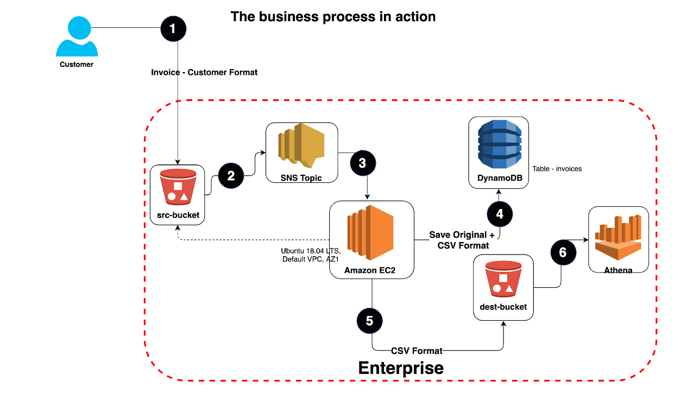

# Project Details 

* The customer uploads the invoice data to S3 bucket in a text format as per their guidelines and policies. This bucket will have a policy to auto delete any content that is more than 1 day old (24 hours).
* An event will trigger in the bucket that will place a message in SNS topic								
* A custom program running in EC2 will subscribe to the SNS topic and get the message placed by S3 event
* The program will use S3 API to read from the bucket, parse the content of the file and create a CSV record along with saving the original record in DynamoDB									
* The program will use S3 API to write CSV record to destination S3 bucket as new S3 object.
* Athena is used to query the CSV file (query to show aggregated expenses grouped by date).									

