#   Project3.md
## Docker Image creation
### Creation of Docker image
#### Instructions

1) Download the given WAR file to a folder /opt/helloworld
   ```

   ssh -i "$HOME/Desktop/glccp.pem" ubuntu@172.31.57.186

   ssh -i "$HOME/Desktop/glccp.pem" ubuntu@ec2-34-229-49-41.compute-1.amazonaws.com 
   sudo apt update 
   sudo apt install docker.io # Install Docker client and Server
   sudo usermod -aG docker ubuntu 
    # relogin to shell to allow the changes to reflect 
    ps -ef | grep docker

   ```

2) Create a Docker file in the same folder in the format given below
wget https://storage.googleapis.com/skl-training/aws-codelabs/aws-intro/HelloWorld.war

vi Dockerfile

```
    FROM tomcat:jre8
    MAINTAINER xxx
    COPY HelloWorld.war /usr/local/tomcat/webapps
```

1) Build the Docker image using the command below
``` 
docker build -t hellworld . 
```
1) Run the image created above using the command given below
``` 
docker run -d -p 80:8080 helloworld  
```
5) Verify that the application can be accessed from the machine using the URL below
    ```
    172.31.57.186/HelloWorld
    ec2-34-229-49-41.compute-1.amazonaws.com/HelloWorld
    ```
Expected screenshots

1) Dockerfile  
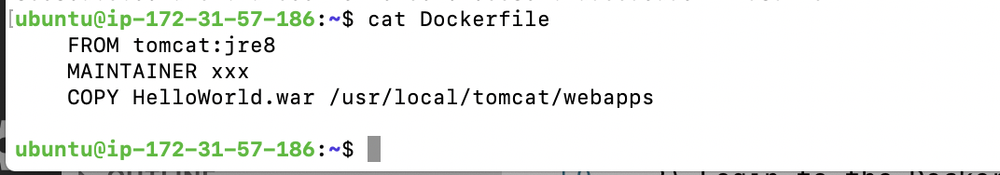
2) Building the Docker image. 
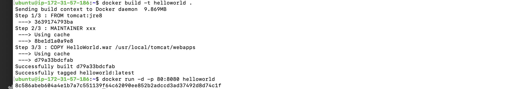
3) Running the image 

4) Verification that the application is running 
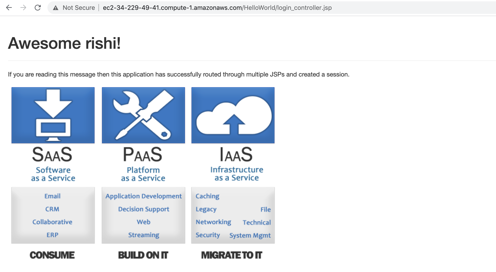

## Upload Image to DockerHub
#### Instructions
1) Create a new free account at hub.docker.com
2) Create a new public repository in your Dockerhub account
3) Login to the DockerHub account from the CLI using the command below
``` 
docker login --username=rishiarora
```
4) Tag the image using the command below
``` 
docker tag <image id> <dockerhub username>/<repository name>:latest 

docker tag helloworld rishiarora/greatelearning:latest 
```
5) Push the image to Dockerhub
``` 
docker push <hub-user>/<repo-name>:latest

docker push rishiarora/helloworld:latest 
```

Expected screenshots

1) Creation of DockerHub Repository 
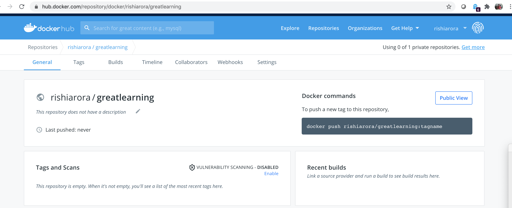
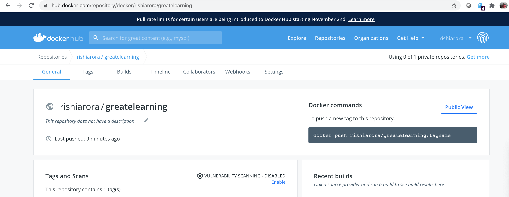
2) Logging into DockerHub via CLI
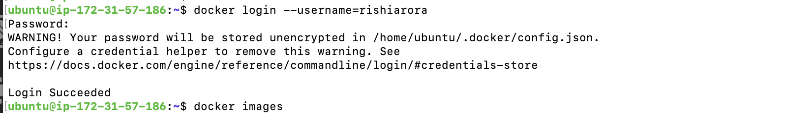
3) Tagging of image 
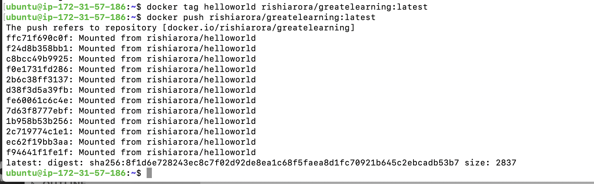
4) Pushing of image to DockerHub
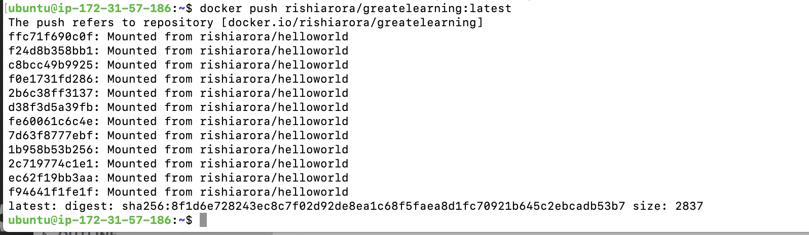


## Creation of ECS cluster to run the image

### a Create the ECS Task, Service and Cluster
#### Instructions
1) Navigate to the ECS service in your AWS Educate account
2) Click on Get Started
3) Under Container Definition, select Custom->Configure
   * Enter the following values
```    
    - Image : docker.io/<dockerhub username>/<dockerhub repository>:latest
                docker.io/rishiarora/greatelearning:latest
    - Memory Limits : 256MB
    - Port Mapping: 8080
    Click on Update and then Next
```
4) Select Load Balancer Type = Application Load Balancer and Click on Next
5) Enter a Cluster Name and Click on Next
6) Click on Create
7) Wait a few minutes for the Cluster to be created

Expected screenshots
1) Container definition 
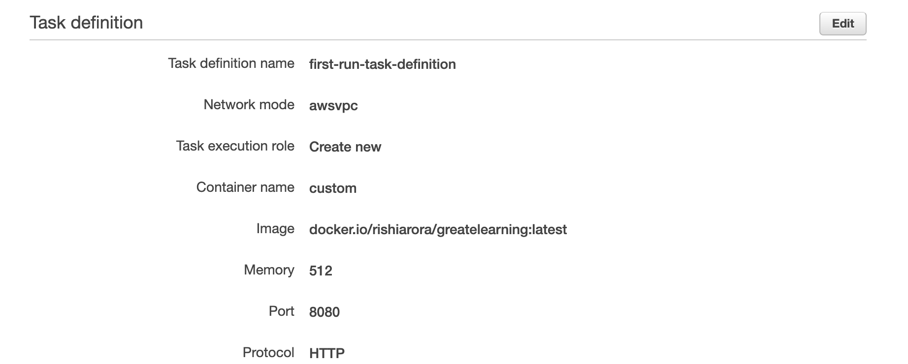
2) Service Definition 
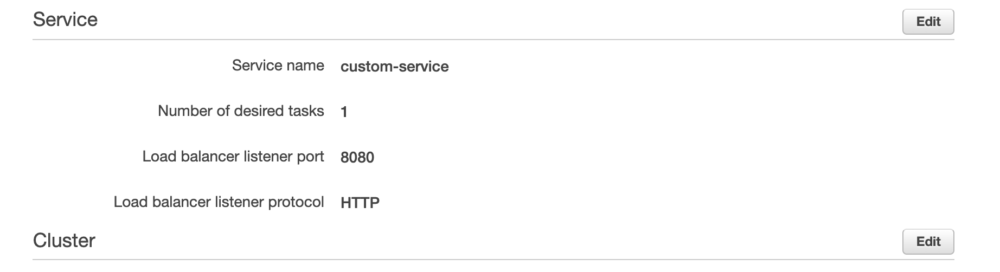
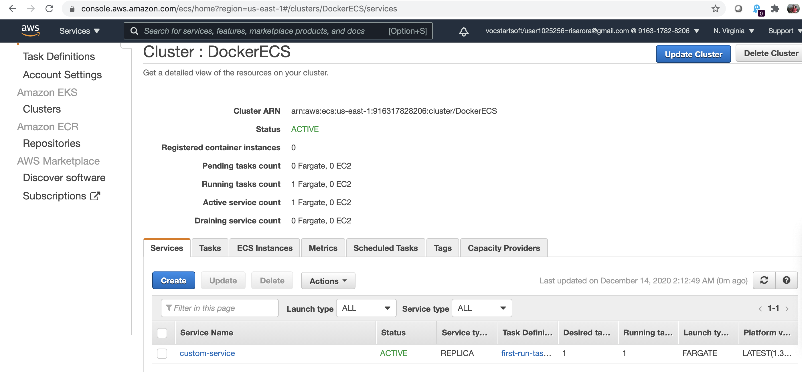
3) Configure Cluster
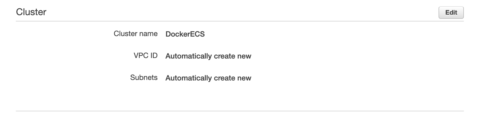


### b Verification of running container on ECS
#### Instructions
1) Navigate to EC2 using the Services Menu
2) Navigate to Load balancer
3) Select the Load Balancer that has been created by the ECS Cluster
4) Take note of the DNS of the load balancer and visit the below URL to verify that the ECS cluster is running the container  
            <DNS of load balancer>:8080/HelloWorld
EC2Co-EcsEl-KCLFMNAH9XQ-836849841.us-east-1.elb.amazonaws.com:8080/HelloWorld
Expected screenshots
1) Load balancer is created 

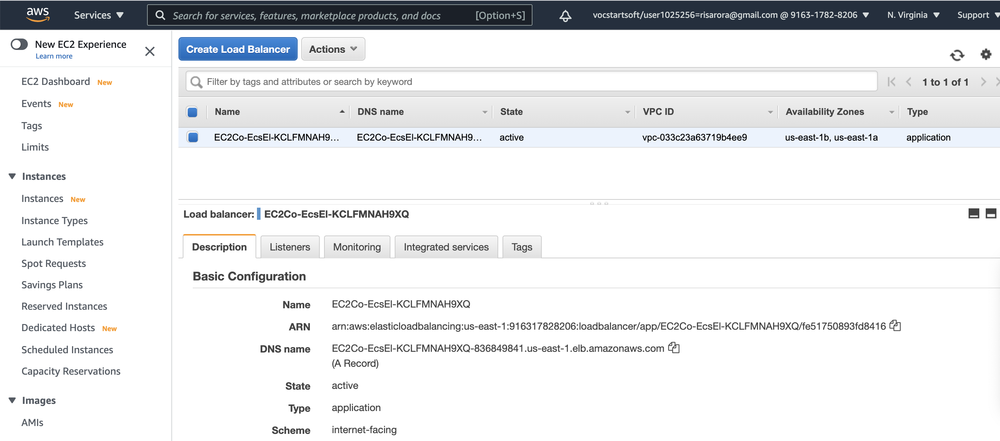

2) Verification of URL 
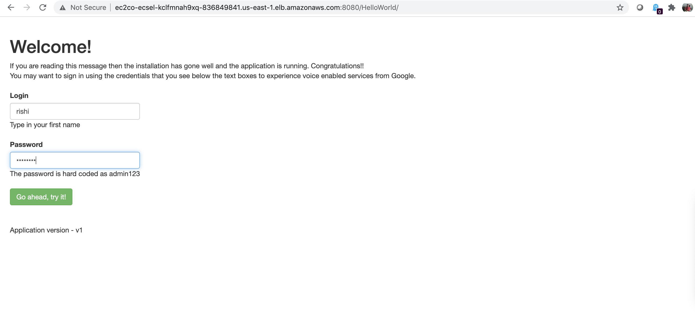
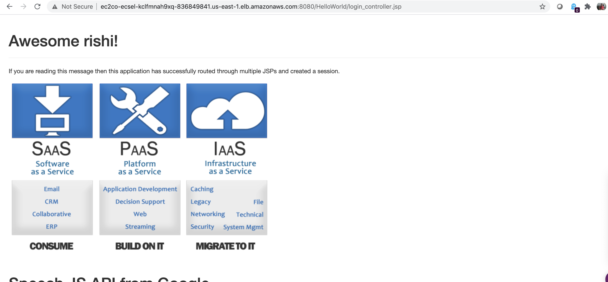