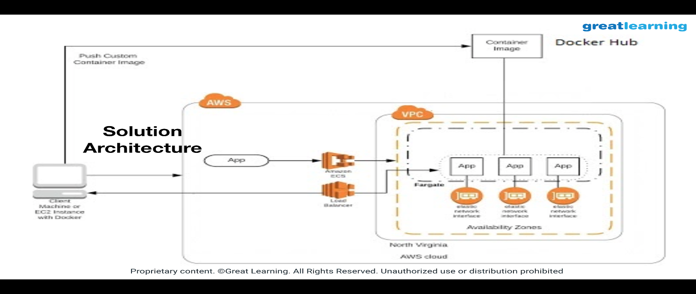

                                                                                                        
## Architecture diagram

## Architecture Implementation

1. Download the WAR file from https://storage.googleapis.com/skl-training/aws-codelabs/aws-intro/HelloWorld.war
2. Web application needs to be packaged as a Docker image running on Tomcat having JRE8 - you will have to write a Dockerfile
3. Once the image is created, run and verify image by accessing web application using ec2 instance public-ip
4. Sign up for docker hub and create public repository. 
5. Tag the image appropriately and push to Docker Hub Repository.
6. Using ECS Fargate create a cluster, task and service(s).   
**Note:** This exercise can also be carried out in an EC2 instance running Ubuntu 18.04, in case it is not possible to run this on a local machine for some reason.
                                                                                                        
                                                                                                        
                                                                                                        
### Answer the following questions
* Q1 What is the significance of 80:8080 when used in the docker run command in Step 2 (a) of the exercise1

    **a)** The tomcat server is set to run on port 80     
    **b)** Port 8080 on the web app maps to port 80 on the host  
    **c)** All ports from 80 to 8080 are set to listen mode  
    **d)** Port 80 on the web app maps to port 8080 on the host  
    Enter your answer here a or c

* Q2 Which of the following permissions was not used by ECS during the cluster creation process in Step 4(a) of the exercise1  

    **a)** Register targets on Load Balancer  
    **b)** Create Log Group  
    **c)** Create VPC  
    **d)** Create NAT Gateway  
    Enter your answer here
                                                                                                        
* Q3 Which protocol is used by the load balancer to listen on port 8080?1

    **a)** HTTP  
    **b)** HTTPS  
    **c)** Telnet  
    **d)** SSH  
    Enter your answer here
                                                                                                        
* Q4 Which of the following will happen in the same Docker image is pushed to Dockerhub multiple times with different tags1

    **a)** Dockerhub will refuse to upload the image  
    **b)** The layers in the first image (if unchanged) will be reused in subsequent pushes  
    **c)** Dockerhub will merge the images  
    **d)** The same image cannot have multple tags  
    Enter your answer here
                                                                                                        
* Q5 Which of the following will run a Docker container in interactive mode?1

    **a)** -t  
    **b)** -i  
    **c)** -it  
    **d)** -u  
    Enter your answer here
                                                                                                        
                                                                                                        
* Q6 How would data persistance be handled in a container environment set up for autoscaling?
     
                                                                                                        
                                                                                                        
* Q8 Debate for or against the following statement - "Docker is the most popular choice for microservices deployment"
