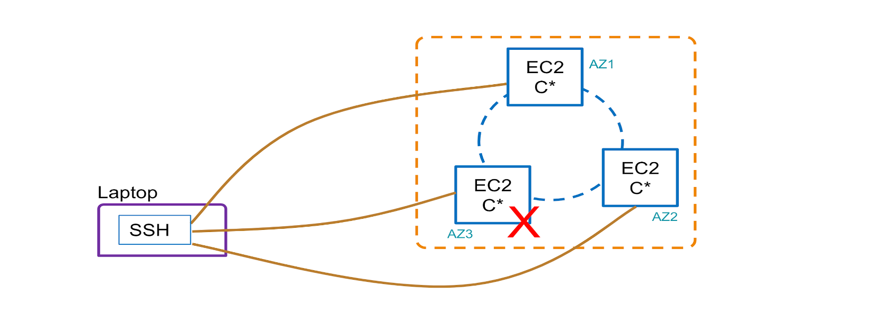

# Big Data Management & Analytics on Cloud

## Architecture diagram
   

## Architecture Implementation

1. Create and configure a3 node Cassandra cluster on EC2
2. Insert some sample data into the cluster
3. Check and change the consisterncy level of the cluster
4. Simulate failure of a node and note down your observations

## MCQs
Q1 How many racks are the 3 nodes created in this exercise distributed among 
a) 1   
b) 3   
c) Variable and left to the learner to decide   
d) 2   
Enter your answer here
 
Q2 What is the replication factor of the cluster in this exercise?1
a) 3   
b) Not defined   
c) Different for each node   
d) 1   
Enter your answer here

Q3 How many replicas must respond for the query to be successful in consistency level Quorum in this exercise?1
a) Exactly 2   
b) Atleast 2   
c) Cannot be determined   
d) More than 1   
Enter your answer here

Q4 Why did the query with consistency level ALL fail in this exercise?1
a) Live replicas < Replication factor   
b) Number of responses < Number of nodes   
c) Data was not saved on node 3   
d) Not enough information to specify a reason   
Enter your answer here

Q5 How can the partitioner used in a cluster be changed with no impact?

